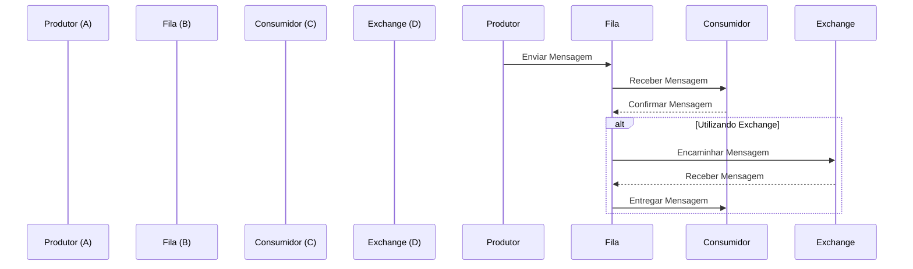

# Rabbit-MQ

## Contexto

O RabbitMQ é um software de mensageiria de código aberto que implementa o protocolo Advanced Message Queuing Protocol (AMQP). Ele fornece uma maneira de enviar e receber mensagens assíncronas entre aplicativos, permitindo que diferentes partes de um sistema se comuniquem e cooperem entre si.

## O que são filas

Em RabbitMQ, as filas são como buffers onde as mensagens são armazenadas temporariamente antes de serem consumidas pelos aplicativos. Elas permitem que os produtores de mensagens enviem mensagens independentemente dos consumidores estarem prontos para processá-las, garantindo assim a escalabilidade e a resiliência do sistema.

### Consumir mensagens, uma ação irreversível 

No RabbitMQ, não permite que uma mensagem seja lida mais de uma vez, ao ser lida, uma mensagem sofre o processo de purge e eliminada na fila, versões mais recentes permitem uma republicação na fila a custo da ordenação/consistência (rabbitmq > 2.7.0). Existem plugins capazes de realizar um debug do fluxo das filas, como por exemplo o [Firehose Tracer | RabbitMQ](https://www.rabbitmq.com/docs/firehose).

## Funcionamento do Rabbit-MQ

Este diagrama representa a interação entre os aplicativos e o RabbitMQ. O produtor (Aplicativo A) envia mensagens para a fila (Aplicativo B), que por sua vez é consumida pelo consumidor (Aplicativo C). O RabbitMQ atua como um intermediário, facilitando a comunicação entre os aplicativos, através da exchange (Aplicativo D), que encaminha as mensagens para a fila.

### O que é a Exchange do RabbitMQ?

A Exchange é um componente fundamental do RabbitMQ responsável por receber mensagens de um produtor e direcioná-las para uma ou mais filas. Ela atua como um roteador de mensagens, determinando como as mensagens devem ser entregues com base em regras de roteamento definidas.

Existem vários tipos de exchanges no RabbitMQ, cada um com um comportamento diferente para rotear as mensagens. Os tipos mais comuns são:

1. **Direct Exchange**: Encaminha mensagens para filas com base em uma chave de roteamento especificada pelo produtor. A mensagem é entregue a uma fila se a chave de roteamento da mensagem corresponder exatamente à chave de roteamento especificada na definição da fila.

2. **Fanout Exchange**: Encaminha mensagens para todas as filas vinculadas a ela. As mensagens são entregues a todas as filas, independentemente da chave de roteamento.

3. **Topic Exchange**: Encaminha mensagens para filas com base em padrões de chave de roteamento. As chaves de roteamento são compostas por palavras-chave separadas por pontos, e a exchange encaminha a mensagem para todas as filas cujas chaves de roteamento correspondem ao padrão especificado.

4. **Headers Exchange**: Encaminha mensagens com base em atributos específicos da mensagem (como headers). As filas são vinculadas à exchange com um conjunto de atributos e a mensagem é entregue à fila cujos atributos correspondem aos atributos da mensagem.

A Exchange desempenha um papel crucial na arquitetura de mensagens do RabbitMQ, permitindo uma comunicação flexível e eficiente entre os produtores e consumidores de mensagens.

## Princípios do RabbitMQ/Filas

Alguns princípios fundamentais do RabbitMQ e do uso de filas incluem:

- **Assincronicidade:** As mensagens são processadas de forma assíncrona, permitindo que os aplicativos continuem funcionando sem esperar por uma resposta imediata.
- **Durabilidade:** As mensagens podem ser armazenadas de forma durável em filas, garantindo que não sejam perdidas em caso de falha.
- **Escalabilidade:** RabbitMQ é altamente escalável, permitindo a distribuição de carga e o processamento de grandes volumes de mensagens.
- **Resiliência:** O RabbitMQ oferece recursos de failover e recuperação para garantir a confiabilidade e a disponibilidade do sistema.
