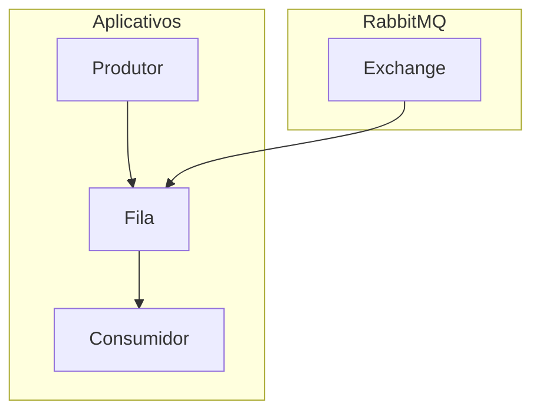

# Rabbit-MQ

## Contexto

O RabbitMQ é um software de mensageria de código aberto que implementa o protocolo Advanced Message Queuing Protocol (AMQP). Ele fornece uma maneira de enviar e receber mensagens assíncronas entre aplicativos, permitindo que diferentes partes de um sistema se comuniquem e cooperem entre si.

## O que são filas

Em RabbitMQ, as filas são como buffers onde as mensagens são armazenadas temporariamente antes de serem consumidas pelos aplicativos. Elas permitem que os produtores de mensagens enviem mensagens independentemente dos consumidores estarem prontos para processá-las, garantindo assim a escalabilidade e a resiliência do sistema.

## Funcionamento do Rabbit-MQ

## Princípios do RabbitMQ/Filas

Alguns princípios fundamentais do RabbitMQ e do uso de filas incluem:

- **Assincronicidade:** As mensagens são processadas de forma assíncrona, permitindo que os aplicativos continuem funcionando sem esperar por uma resposta imediata.
- **Durabilidade:** As mensagens podem ser armazenadas de forma durável em filas, garantindo que não sejam perdidas em caso de falha.
- **Escalabilidade:** RabbitMQ é altamente escalável, permitindo a distribuição de carga e o processamento de grandes volumes de mensagens.
- **Resiliência:** O RabbitMQ oferece recursos de failover e recuperação para garantir a confiabilidade e a disponibilidade do sistema.